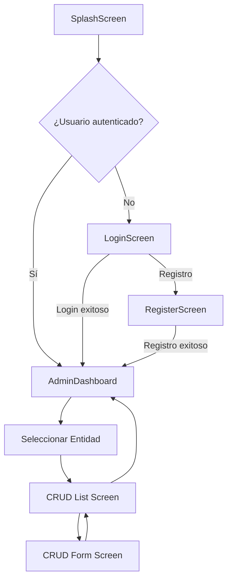

# 🏥 Plan de Implementación: StarMedica - Aplicación Médica Flutter

> **Nota:** Este es un plan estratégico de implementación. **No incluye código aún**, como solicitaste.

---

## 📋 Resumen del Proyecto

| Elemento | Detalle |
|----------|---------|
| **Nombre** | StarMedica |
| **Plataformas** | Android, iOS, Web, Windows |
| **Framework** | Flutter + Dart |
| **Backend** | Firebase (Authentication + Cloud Firestore) |
| **State Management** | Provider |
| **Estilo** | Moderno, profesional, responsive |
| **Paleta de Colores** | Azul Marino `#003366`, Rojo `#D32F2F`, Blanco, Gris `#F5F5F5` |
| **Logo** | [URL proporcionada](https://raw.githubusercontent.com/hrzr0599/imagenes-para-fluter-6-I-11-Feb-26/refs/heads/main/logo.JPG) |

---

## 🛠️ Herramientas y Dependencias Requeridas

### 🔧 Herramientas de Desarrollo
```
✅ Flutter SDK (3.16+ recomendado)
✅ Dart SDK (3.2+)
✅ Android Studio / VS Code
✅ Firebase CLI
✅ Git para control de versiones
✅ Firebase Console (proyecto: starmedicacrud)
```

### 📦 Dependencias para `pubspec.yaml`

```yaml
dependencies:
  flutter:
    sdk: flutter
  
  # Firebase
  firebase_core: ^2.24.2
  firebase_auth: ^4.16.0
  cloud_firestore: ^4.14.0
  firebase_storage: ^11.6.0
  
  # State Management
  provider: ^6.1.1
  
  # UI/UX Enhancements
  google_fonts: ^6.1.0
  flutter_svg: ^2.0.9
  cached_network_image: ^3.3.0
  fluttertoast: ^8.2.4
  intl: ^0.19.0
  
  # Utilidades
  uuid: ^4.3.3
  form_field_validator: ^1.1.0
  connectivity_plus: ^5.0.2
  
  # Navegación
  go_router: ^13.2.0  # Opcional, para navegación avanzada

dev_dependencies:
  flutter_test:
    sdk: flutter
  flutter_lints: ^3.0.1
  build_runner: ^2.4.7
```

---

## 🎨 Guía de Estilo y UX/UI

### Paleta de Colores Oficial
```dart
// assets/theme/app_colors.dart (por definir)
primaryColor: Color(0xFF003366),    // Azul Marino - Headers, botones primarios
accentColor: Color(0xFFD32F2F),     // Rojo - Alertas, acciones críticas
backgroundColor: Colors.white,      // Fondos principales
surfaceColor: Color(0xFFF5F5F5),    // Tarjetas, secciones secundarias
textPrimary: Color(0xFF212121),     // Texto principal
textSecondary: Color(0xFF757575),   // Texto secundario
```

### Componentes de Diseño
| Componente | Especificaciones |
|------------|-----------------|
| **AppBar** | Azul marino, bordes inferiores redondeados (20px), logo centrado, sombra suave |
| **Banner de Bienvenida** | Gradiente sutil, texto blanco, animación de entrada |
| **Tarjetas CRUD** | Elevación 4, bordes 12px, icono + título, efecto hover (web/desktop) |
| **Botones** | Primarios: azul con texto blanco; Secundarios: outline rojo; Tamaño mínimo 48px |
| **Inputs** | Borde redondeado 8px, foco con azul primario, validación en tiempo real |
| **Footer** | Fijo en parte inferior, texto centrado, gris oscuro, altura 40px |

### Responsive Design Strategy
```
📱 Mobile (<600px): 
  - Layout vertical, navegación inferior
  - Menú hamburguesa para CRUDs
  - Tarjetas en lista única

💻 Tablet/Web (600px-1200px):
  - Grid 2x2 para botones de entidades
  - AppBar con navegación lateral colapsable

🖥️ Desktop (>1200px):
  - Navigation Rail lateral fijo
  - Dashboard con vista previa de datos
  - Soporte para hover y atajos de teclado
```

---

## 🔐 Flujo de Autenticación y Seguridad

### Arquitectura de Login
```
1. SplashScreen (2s) → Verifica sesión activa
2. Si NO hay sesión → LoginScreen
3. Si hay sesión → Verifica rol → AdminDashboard / (futuro: Vista Paciente)
```

### Pantalla de Login
- Logo centrado en banner azul con bordes redondeados inferiores
- Campos: Email, Password (con toggle de visibilidad)
- Botones: "Iniciar Sesión", "Registrarse", "¿Olvidaste tu contraseña?"
- Validaciones: formato email, longitud password, feedback visual
- Integración con Firebase Authentication (email/password)

### Registro de Usuarios
- Campos adicionales: Nombre completo, Teléfono, Rol (Médico, Enfermero, Admin)
- Verificación de email opcional (configurable en Firebase)
- Almacenamiento inicial en colección `users` de Firestore

### Reglas de Seguridad Firestore (por configurar en consola)
```javascript
// Ejemplo conceptual - se definirá en Firebase Console
rules_version = '2';
service cloud.firestore {
  match /databases/{database}/documents {
    // Solo usuarios autenticados pueden leer/escribir
    match /{document=**} {
      allow read, write: if request.auth != null;
    }
    // Futuro: reglas por rol y por colección
  }
}
```

---

## 🗂️ Estructura de Carpetas del Proyecto

```
lib/
├── main.dart                          # Punto de entrada, inicialización Firebase
├── app/
│   ├── router.dart                    # Configuración de rutas (go_router)
│   └── theme.dart                     # Tema global, colores, tipografía
│
├── core/
│   ├── constants/
│   │   ├── app_constants.dart         # URLs, IDs de proyecto Firebase
│   │   └── route_constants.dart       # Nombres de rutas
│   ├── utils/
│   │   ├── validators.dart            # Validaciones de formularios
│   │   └── helpers.dart               # Funciones utilitarias
│   └── widgets/
│       ├── custom_app_bar.dart        # AppBar personalizado con logo
│       ├── custom_footer.dart         # Footer con copyright
│       ├── custom_button.dart         # Botones reutilizables
│       └── loading_indicator.dart     # Indicador de carga global
│
├── features/
│   ├── auth/
│   │   ├── data/
│   │   │   ├── repositories/
│   │   │   │   └── auth_repository.dart
│   │   │   └── models/
│   │   │       └── user_model.dart
│   │   ├── domain/
│   │   │   └── entities/
│   │   │       └── user_entity.dart
│   │   └── presentation/
│   │       ├── screens/
│   │       │   ├── login_screen.dart
│   │       │   └── register_screen.dart
│   │       ├── providers/
│   │       │   └── auth_provider.dart
│   │       └── widgets/
│   │           ├── login_form.dart
│   │           └── register_form.dart
│   │
│   ├── dashboard/
│   │   ├── presentation/
│   │   │   ├── screens/
│   │   │   │   └── admin_dashboard.dart
│   │   │   └── widgets/
│   │   │       ├── entity_card.dart   # Tarjeta para cada tabla CRUD
│   │   │       └── welcome_banner.dart
│   │
│   └── crud/
│       ├── data/
│       │   ├── services/
│       │   │   └── firestore_service.dart  # Servicio genérico CRUD
│       │   └── repositories/
│       │       └── generic_repository.dart
│       ├── domain/
│       │   └── entities/
│       │       ├── paciente_entity.dart
│       │       ├── medico_entity.dart
│       │       └── ... (una por entidad)
│       └── presentation/
│           ├── screens/
│           │   ├── crud_list_screen.dart   # Reutilizable para todas las tablas
│           │   ├── crud_form_screen.dart   # Formulario dinámico
│           │   └── crud_detail_screen.dart
│           ├── providers/
│           │   └── crud_provider.dart
│           └── widgets/
│               ├── search_bar_custom.dart
│               └── confirmation_dialog.dart
│
├── config/
│   ├── firebase_options.dart          # Generado por FlutterFire CLI
│   └── injection_container.dart       # (Opcional) Inyección de dependencias
│
└── assets/
    ├── images/
    │   └── logo.jpg                   # Logo descargado localmente
    ├── fonts/
    └── icons/
```

---

## 🔄 Flujo de Navegación Principal



---

## 📊 Estrategia de Mapeo: Entidades → Firestore Collections

| Entidad (SQL) | Colección Firestore | Campos Clave | Notas |
|--------------|---------------------|--------------|-------|
| PACIENTE | `patients` | id, nombre, apellidos, curp, fecha_nacimiento | Indexar por curp |
| EXPEDIENTE_CLINICO | `medical_records` | paciente_id, alergias, antecedentes | Subcolección o referencia |
| MEDICO | `doctors` | empleado_id, especialidad_id, cedula_prof | Relación con Employee |
| CONSULTA | `appointments` | paciente_id, medico_id, fecha_hora, diagnostico | Indexar por fecha |
| MEDICAMENTO | `medications` | nombre_generico, precio_unitario | Catálogo estático |
| RECETA | `prescriptions` | consulta_id, medicamentos[] | Subcolección de items |
| HOSPITALIZACION | `hospitalizations` | paciente_id, cama_id, fechas | Control de disponibilidad |
| ... | ... | ... | *(Continuar para las 20+ entidades)* |

> 💡 **Recomendación:** Usar referencias documentales (`DocumentReference`) para relaciones en lugar de duplicar datos.

---

## 🚀 Plan de Implementación Paso a Paso

### 📅 Fase 1: Configuración Inicial (Días 1-2)
```
✅ [ ] Crear proyecto Flutter: flutter create --org com.starmedica starmedica_app
✅ [ ] Configurar soporte multiplataforma: 
      flutter config --enable-windows-desktop
      flutter config --enable-web
✅ [ ] Crear proyecto en Firebase Console: starmedicacrud
✅ [ ] Registrar apps para Android, Web, Windows en Firebase
✅ [ ] Ejecutar FlutterFire CLI: flutterfire configure
✅ [ ] Actualizar pubspec.yaml con dependencias listadas
✅ [ ] Ejecutar flutter pub get
✅ [ ] Configurar google-services.json / GoogleService-Info.plist
✅ [ ] Crear estructura de carpetas según arquitectura definida
✅ [ ] Implementar app/theme.dart con paleta de colores oficial
```

### 📅 Fase 2: Autenticación y Navegación Base (Días 3-5)
```
✅ [ ] Implementar firebase_options.dart con configuración del proyecto
✅ [ ] Crear AuthService con métodos: signIn, signUp, signOut, getCurrentUser
✅ [ ] Desarrollar AuthProvider (ChangeNotifier) para estado de autenticación
✅ [ ] Diseñar LoginScreen con banner azul, logo, formulario y footer
✅ [ ] Diseñar RegisterScreen con validaciones y selección de rol
✅ [ ] Configurar go_router con rutas protegidas (AuthGuard)
✅ [ ] Implementar SplashScreen con verificación de sesión
✅ [ ] Pruebas de flujo completo: registro → login → dashboard → logout
```

### 📅 Fase 3: Dashboard Administrativo (Días 6-7)
```
✅ [ ] Crear AdminDashboard con GridView responsive de entidades
✅ [ ] Desarrollar EntityCard widget reutilizable (icono + nombre + contador)
✅ [ ] Implementar CustomAppBar con logo y mensaje de bienvenida dinámico
✅ [ ] Implementar CustomFooter con "Hernandez Roman A. 2026 6°I"
✅ [ ] Agregar animaciones de entrada (FadeTransition, SlideTransition)
✅ [ ] Configurar navegación desde dashboard a pantallas CRUD
✅ [ ] Pruebas de responsive en móvil, tablet y web
```

### 📅 Fase 4: Motor CRUD Genérico (Días 8-12)
```
✅ [ ] Crear FirestoreService genérico con métodos: 
      create, readAll, readById, update, delete, search
✅ [ ] Implementar GenericRepository con manejo de errores y offline
✅ [ ] Desarrollar CrudProvider para estado y operaciones de datos
✅ [ ] Crear CrudListScreen reutilizable: 
      - DataTable responsive / ListView en móvil
      - Búsqueda en tiempo real
      - Paginación con limit/query cursors
      - Botones de acción por fila (editar/eliminar)
✅ [ ] Crear CrudFormScreen dinámico:
      - Generación de campos según esquema de entidad
      - Validaciones específicas (CURP, fechas, números)
      - Manejo de relaciones (dropdowns con datos de otras colecciones)
✅ [ ] Implementar confirmación de eliminación con diálogo personalizado
✅ [ ] Agregar indicadores de carga y manejo de errores de red
```

### 📅 Fase 5: Implementación de Entidades Críticas (Días 13-18)
```
✅ [ ] PACIENTE: CRUD completo con validación de CURP único
✅ [ ] MÉDICO: CRUD con selección de especialidad y turno
✅ [ ] CONSULTA: CRUD con relación paciente-médico y validación de horarios
✅ [ ] MEDICAMENTO: CRUD de catálogo con búsqueda por nombre genérico/comercial
✅ [ ] RECETA: CRUD con subcolección de medicamentos y cálculo de dosis
✅ [ ] HOSPITALIZACION: CRUD con validación de disponibilidad de camas
✅ [ ] Implementar filtros avanzados y exportación básica (CSV)
```

### 📅 Fase 6: Optimización y Testing (Días 19-21)
```
✅ [ ] Implementar caching con Hive o SharedPreferences para datos estáticos
✅ [ ] Agregar soporte offline con Firebase offline persistence
✅ [ ] Optimizar queries con índices compuestos en Firestore
✅ [ ] Pruebas unitarias para servicios y providers
✅ [ ] Pruebas de integración para flujos críticos (login → CRUD → logout)
✅ [ ] Pruebas de usabilidad en dispositivos reales (Android/iOS)
✅ [ ] Ajustes de accesibilidad: contrastes, tamaños de texto, labels
✅ [ ] Generar builds de prueba: 
      flutter build apk --release
      flutter build web --release
      flutter build windows --release
```

### 📅 Fase 7: Despliegue y Documentación (Días 22-23)
```
✅ [ ] Configurar Firebase Hosting para versión web
✅ [ ] Generar APK firmado para Android (keystore)
✅ [ ] Preparar instalador para Windows (MSIX)
✅ [ ] Documentar arquitectura y decisiones técnicas en README.md
✅ [ ] Crear guía de usuario básica para personal médico
✅ [ ] Configurar Firebase Crashlytics para monitoreo de errores
✅ [ ] Establecer plan de mantenimiento y actualizaciones
```

---

## ⚙️ Configuraciones Específicas de Firebase

### Archivo `lib/config/firebase_options.dart` (generado por FlutterFire)
```dart
// Se generará automáticamente con:
// flutterfire configure --project=starmedicacrud
// Contendrá: 
// - FirebaseOptions para Android, iOS, Web, Windows
// - Project ID: starmedicacrud
// - App ID y API Key correspondientes
```

### Reglas Iniciales para Firestore (Firebase Console)
```javascript
// En Consola Firebase > Firestore > Rules
rules_version = '2';
service cloud.firestore {
  match /databases/{database}/documents {
    // Permitir acceso solo a usuarios autenticados
    match /{document=**} {
      allow read, write: if request.auth != null;
    }
    
    // Ejemplo de regla específica para pacientes (futuro)
    // match /patients/{patientId} {
    //   allow read: if request.auth != null;
    //   allow write: if get(/databases/$(database)/documents/users/$(request.auth.uid)).data.role == 'admin';
    // }
  }
}
```

### Configuración de Authentication
```
✅ Habilitar método: Email/Password
✅ Configurar dominio autorizado para Web (localhost para desarrollo)
✅ Habilitar verificación de email (opcional para MVP)
✅ Configurar límites de tasa para prevenir abuso
```

---

## 🧪 Estrategia de Testing

| Tipo | Herramienta | Cobertura Objetivo |
|------|-------------|-------------------|
| **Unitarias** | flutter_test, mockito | Servicios, providers, validadores |
| **Widget** | flutter_test, integration_test | Componentes UI críticos (LoginForm, EntityCard) |
| **Integración** | integration_test | Flujo completo: login → dashboard → CRUD → logout |
| **E2E** | patrol o maqito | Escenarios reales en dispositivo/emulador |
| **Performance** | Flutter DevTools | Tiempos de carga, uso de memoria, frame rate |

---

## 📦 Consideraciones de Build Multiplataforma

### Android
```yaml
# android/app/build.gradle
minSdkVersion 23
targetSdkVersion 34
# Configurar keystore para release
# Permissions: INTERNET, ACCESS_NETWORK_STATE
```

### Web
```yaml
# web/index.html
<!-- Agregar meta tags para responsive -->
<!-- Configurar Firebase SDK en <head> -->
# Habilitar CanvasKit para mejor rendimiento: 
# flutter build web --web-renderer canvaskit
```

### Windows
```yaml
# windows/CMakeLists.txt
# Requerir Windows 10 SDK 19041+
# Configurar icono y metadatos de la aplicación
# flutter build windows --release
```

---

## 🔜 Próximos Pasos Inmediatos

1. **Ejecutar comandos de inicialización** (Fase 1)
2. **Confirmar configuración de Firebase** en consola con Project ID: `starmedicacrud`
3. **Validar dependencias** con `flutter pub get` y resolver conflictos
4. **Implementar SplashScreen y Login** como primer entregable funcional
5. **Establecer reuniones de revisión** cada 2 días para ajustar el plan

---

> ✨ **Nota Final:** Este plan está diseñado para ser iterativo. Cada fase genera un entregable funcional que puede ser probado y ajustado antes de continuar. La arquitectura modular permite escalar fácilmente a nuevas entidades o plataformas en el futuro.

# Prompt
Antigravity 
Flutter para Android/web/windows/IOS
Plan de implementación extenso
Usar estándar no utilizar la opción de producción, no me des codigo aun

Quiero crear una aplicación en base a Flutter con Dart con soporte de plataforma para administrar una CRUD en base a las tablas adjuntas de un hospital con todas las plataformas android/web/windows
CRUD para aplicacion médica profesional y moderna llamada 'StarMedica'. 

Diseño moderno, profesional y limpio pero no sencillo, utiliza una paleta de colores basada en: Azul Marino (#003366) para elementos primarios, Rojo (#D32F2F) para acentos y acciones importantes, Blanco para limpieza y Gris muy claro (#F5F5F5).
Imagen para el logo (URL: https://raw.githubusercontent.com/hrzr0599/imagenes-para-fluter-6-I-11-Feb-26/refs/heads/main/logo.JPG).

La aplicación debe poder ser visible correctamente y sin problemas en un dispositivo movil y el layout debera estar basado para administrar/gestionar

Dime qué herramientas y dependencias se requieren
ui, ux, login autenticacion, usuario password, base de datos firestore, provider, dependencias en pubsec.yaml, antes de que proporciones codigo, quiero crear un plan de implementacion para desarrolar la aplicacion "StarMedica", procedimiento paso a paso para el desarrollo
integrar las dependencias y configuraciones necesarias actualizar pubspec.yaml, mi proyecto es console firebase, integración de los archivos .dart necesarios en la carpeta bin y subcarpetas, proyecto totalmente funcional

La aplicación inicia con un login funcional (iniciar sesión, registrarse), Incluye un banner superior azul con bordes inferiores redondeados que incluya el logo y un mensaje de bienvenida. 

Incluye un footer que diga 'Hernandez Roman A. 2026 6°I' como derechos de autor.

Y despues de hacer eso dar acceso al CRUD, firebase y firestore, en una pantalla de administracion que muestre botones con icono y con el nombre de cada tabla, despues al presionar mandar a la tabla correspondiente de cada CRUD

Utilizar widgets atractivos y modernos, usar firebase autenticación, Cloud Firestore, no se te olvide integrar las dependencias y configuraciones necesarias actualizar pubspec.yaml, mi proyecto es console firebase es starmedicacrud, integración de los archivos .dart necesarios en la carpeta bin y subcarpetas, proyecto totalmente funcional
La vinculacion con la base de datos en firebase: Project Name: starmedicacrud, Project ID: starmedicacrud, Project Number: 445826834447
